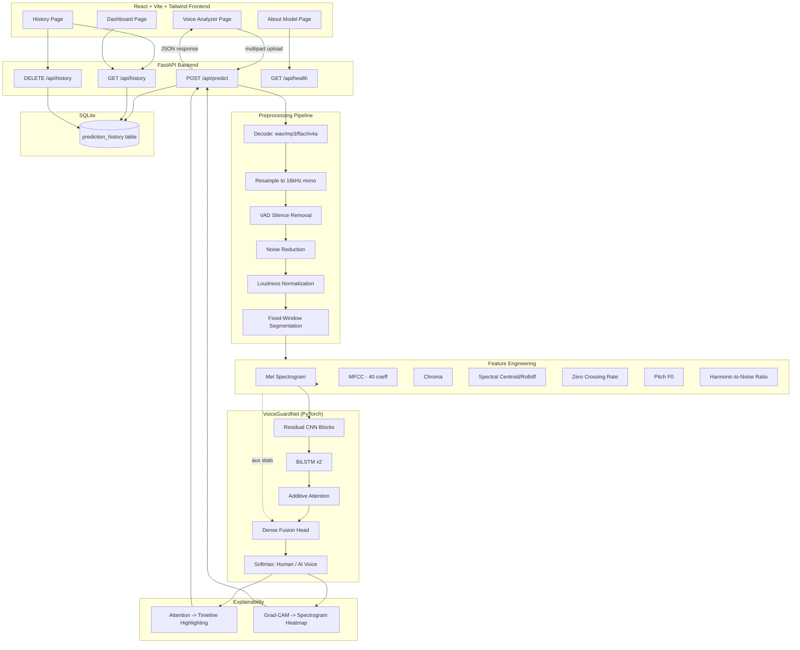
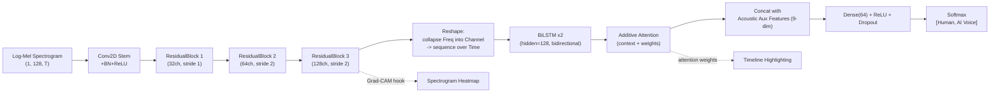

# VoiceGuard AI — System Architecture

## 1. High-Level System Diagram



## 2. Model Architecture Detail



## 3. Request Lifecycle (POST /api/predict)

1. User uploads audio via drag-and-drop in the **Voice Analyzer** page.
2. FastAPI validates extension (`.wav/.mp3/.flac/.m4a`) and size (≤ 25MB).
3. `preprocessing.audio_preprocessing.preprocess_audio()` decodes, resamples,
   trims silence (VAD), denoises, normalizes loudness, and segments into
   4-second windows.
4. For each window, `preprocessing.feature_extraction.extract_features()`
   computes the Mel spectrogram (model input) plus MFCC/Chroma/Centroid/
   Rolloff/ZCR/Pitch/HNR (auxiliary features + UI display).
5. `models.inference.VoiceGuardInference.predict()` runs each window through
   `VoiceGuardNet`, averages window-level softmax probabilities into a
   clip-level verdict, and computes:
   - Attention-derived suspicious region timeline
   - Grad-CAM heatmap over the last conv block
   - Waveform + Mel spectrogram + Grad-CAM overlay PNGs (base64-encoded)
6. Result is persisted to SQLite (`prediction_history` table) and returned
   as JSON to the frontend, which renders the verdict banner, confidence
   gauge, probability bars, waveform/spectrogram images, and suspicious
   timeline.

End-to-end target latency for a 10-second clip: **< 3 seconds** on CPU for
inference alone (excluding network transfer), achieved via a lightweight
3-block residual CNN, single-pass windowed inference, and caching the
model in memory at process startup (no cold-start reload per request).

## 4. Folder Structure

```
voiceguard-ai/
│
├── backend/
│   ├── api/                  # FastAPI routes + Pydantic schemas
│   ├── models/                # Architecture, inference engine, explainability
│   ├── preprocessing/         # Audio cleaning + feature extraction
│   ├── training/               # Dataset prep, PyTorch Dataset, training loop
│   ├── config.py               # Central configuration
│   ├── database.py             # SQLite models + CRUD helpers
│   ├── app.py                  # FastAPI entrypoint
│   └── requirements.txt
│
├── frontend/
│   ├── src/
│   │   ├── components/         # Sidebar, Topbar, Dropzone, charts, timeline
│   │   ├── pages/               # Dashboard, VoiceAnalyzer, History, AboutModel
│   │   └── services/api.js      # Axios API layer
│   ├── package.json
│   └── tailwind.config.js
│
├── dataset/
│   ├── raw/                     # User-provided raw corpora (gitignored)
│   └── processed/                # Cached waveforms + manifest CSVs
│
├── notebooks/                    # EDA / experimentation notebooks
├── docs/                          # This file, API docs, resume description
└── README.md
```
